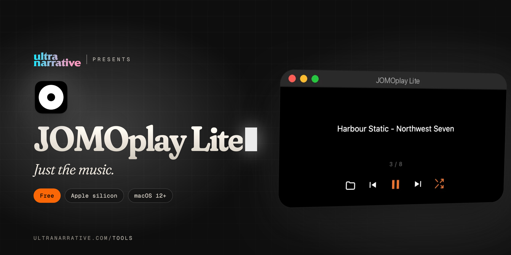

  

# JOMOplay Lite

**Just the music.**

*Dan Rodriguez · [UltraNarrative](https://www.ultranarrative.com) · [ultranarrative.com/tools](https://www.ultranarrative.com/tools) · [dan@ultranarrative.com](mailto:dan@ultranarrative.com) · October 2026*

---

JOMOplay with everything else taken away. Load a playlist, press play, shuffle. Light enough to keep your Mac cool.

Free, for a Mac with Apple silicon, macOS 12 or later. This repository holds the installer only. More free apps at [ultranarrative.com/tools](https://www.ultranarrative.com/tools).

## Download

[JOMOplay-Lite-mac-arm64.dmg](https://github.com/ultranarrative/jomoplay-lite-releases/releases/latest/download/JOMOplay-Lite-mac-arm64.dmg)

This link always points to the newest version.

## Opening it the first time

I sign JOMOplay Lite myself rather than through Apple, so macOS asks once. Open the disk image, drag JOMOplay Lite to Applications and open it. When macOS stops it, go to System Settings, then Privacy & Security, and click Open Anyway.

## Support

JOMOplay Lite is free, with no account and no subscription. If it helps you, [buy me a coffee](https://ko-fi.com/danrsuarez).

Made by Dan Rodriguez at [UltraNarrative](https://ultranarrative.com). © 2026 UltraNarrative. All rights reserved.
